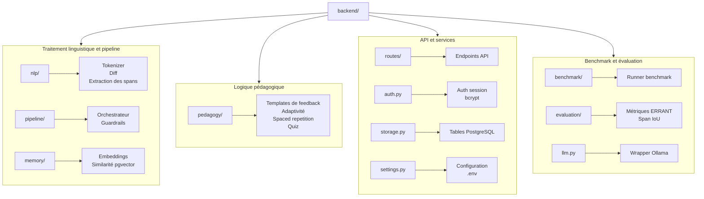

# README

# Apprentissage de Langues Assisté par LLM (GEC)

> Conception et évaluation d'un système d'apprentissage de langues assisté par un modèle de langage, architecture, pipeline de traitement et optimisation des interactions apprenant-machine
>
> Duvivier Sacha — Master 2 Cyber — FGES — 2025-2026 · Présentation poster 4 juin 2026 #CYB24

---

## En pratique, ça fait quoi ?

Tu écris une phrase en anglais. L'application la corrige, t'explique pourquoi c'est faux, et t'entraîne sur tes erreurs récurrentes.

**Exemple :**

> Tu écris : *"She go to the school yesterday."*

Le système :
1. **Corrige** la phrase via un LLM (`→ "She went to school yesterday."`)
2. **Identifie** les erreurs au niveau du token (mauvais temps verbal, article superflu)
3. **Classe** chaque erreur par type (ici : accord sujet-verbe, déterminant) et niveau CECRL
4. **Génère un feedback pédagogique** via des templates prédéfinis — jamais du texte brut du modèle
5. **Mémorise** tes erreurs et adapte les exercices suivants pour cibler ce que tu rates le plus

Le LLM ne fait qu'une seule chose : proposer une phrase corrigée. Tout le reste — extraire les erreurs, les classifier, produire le feedback, choisir les exercices — est du code déterministe. Cela permet de contrôler exactement ce que l'apprenant reçoit, et de mesurer précisément la qualité du système.

---

## Présentation

Ce projet est le prototype implémenté dans le cadre d'un mémoire de recherche. L'objectif est d'intégrer un LLM dans une architecture contrôlée pour produire un feedback pédagogique structuré, en opposition à une utilisation brute du modèle.

Le LLM est utilisé **uniquement** pour la correction de la phrase. Toute l'extraction d'erreurs, la classification et la génération du feedback sont des étapes déterministes du pipeline.

---

## Hypothèses

**H1** — Un pipeline structuré permet de transformer une correction brute en feedback pédagogique exploitable tout en conservant une qualité de correction proche du LLM brut.

**H2** — Un moteur adaptatif basé sur l'historique d'erreurs peut prioriser correctement les difficultés d'un apprenant et cibler les exercices en conséquence.

---

## Résultats (benchmark W&I+LOCNESS BEA-2019 — 2757 phrases)

|Métrique|llm_brut|pipeline_structuré|pipeline+mémoire|
| ---------------------------| ----------| ---------------------| -------------------|
|TSF0.5|0.9100|0.8919|0.8922|
|ERRANT F0.5 (moy. 6 runs)|0.5727|0.4877|0.5087|
|Exact match|0.1357|0.1857|0.1869|
|Span F0.5|0.3011|0.3604|0.3605|
|Feedback présent|0%|100%|100%|
|Alignement type/gold|0%|19.0%|19.0%|

**H2 — groupe expérimental vs témoin (25 profils chacun)**

|Métrique|Expérimental|Témoin|
| -------------------------| ---------------| ---------|
|top_priority_match_rate|1.00|1.00|
|exercise_match_rate|0.96|0.00|
|extinct_top1_rate|0.44|0.00|

---

## Architecture

→ tokenize (nlp/tokenizer.py)  
→ LLM correction (llm.py → Ollama)  
→ token-level diff + span extraction (nlp/error_extraction.py)  
→ error type classification (heuristique)  
→ feedback template lookup (pedagogy/feedback_generator.py)  
→ pgvector similarity search (memory/similarity.py)  
→ guardrails validation (pipeline/guardrails.py)  
→ store PostgreSQL + Redis cache  
→ CorrectResponse JSON

### Stack

Tout est disponnible sous Docker via docker compose si besoin 😉

|Composant|Technologie|
| ------------------| -----------------------------|
|Backend|FastAPI + Python 3.11+|
|Frontend|Vue 3 + Vite + Tailwind CSS|
|Base de données|PostgreSQL 16 + pgvector|
|Cache|Redis 7|
|LLM|Ollama — `bjoernb/gemma4-31b-think:latest`|

### Structure

‍



---

## Lancement

### Avec Docker (recommandé)

```bash
make up
make down
make logs
make health
```

### Sans Docker

```bash
# Backend
python3 -m venv .venv && source .venv/bin/activate
pip install -r requirements.txt
python main.py

# Frontend (terminal séparé)
cd frontend-vue && npm install
npm run dev
```

### Variables d'environnement

Copier `.env.example`​ en `.env` et renseigner les différentes variables d'environnement :

---

## Reproduire le benchmark H1 (Très long ~48h ~ APPLE M1)

```bash
# Via API (nécessite services Docker actifs)
curl -X POST http://localhost:8000/api/benchmark/run

# Analyser les résultats
python utils/analyze_benchmark.py
```

Les résultats bruts sont dans `results/h1_benchmark_outputs/`.

## Reproduire la simulation H2 (Moins long ~1h ~ APPLE M1)

```bash
# Simulation groupe expérimental vs témoin (50 profils)
python utils/simulate_h2_extended.py

# Analyser
python utils/analyze_h2.py
```

Les résultats sont dans `results/h2_benchmark_outputs/h2_extended/`.

---

## Dataset

W&I+LOCNESS (BEA-2019) — phrases rédigées par des apprenants, corrections annotées manuellement.

- **2757 phrases** avec au moins une erreur conservées pour l'évaluation
- Métrique principale : ERRANT F0.5 (pénalise davantage les mauvaises corrections que les non-corrections)
- Licences : `data/licence.wi.txt`​, `data/license.locness.txt`

---

## Les points forts du projet de recherche

- LLM utilisé uniquement pour la génération de la correction — jamais pour l'extraction ou la classification des erreurs
- Extraction d'erreurs déterministe (diff token + heuristiques)
- Feedback généré par templates indexés sur `(error_type, cecrl_level)`
- Fallback : Ollama indisponible → erreur 503 ; Redis indisponible → cache mémoire

---

## API principale

|Endpoint|Méthode|Description|
| ----------| ----------| ----------------------------------|
| */correct*|POST|Correction + feedback structuré|
| */exercise/adaptive*|GET|Exercice adaptatif|
| */exercise/grade*|POST|Correction exercice|
| */quiz*|GET|Question quiz adaptative|
| */quiz/submit*|POST|Soumettre réponse quiz|
| */learner/{userId}/progress*|GET|Progression apprenant|
| */api/benchmark/run*|POST|Lancer benchmark|
| */health*|GET|Santé du service|
| */docs*|GET|Swagger UI|

---

## Credits

Centre for English Corpus Linguistics (CECL), Université catholique de Louvain, Belgium. (Pour le dataset).
